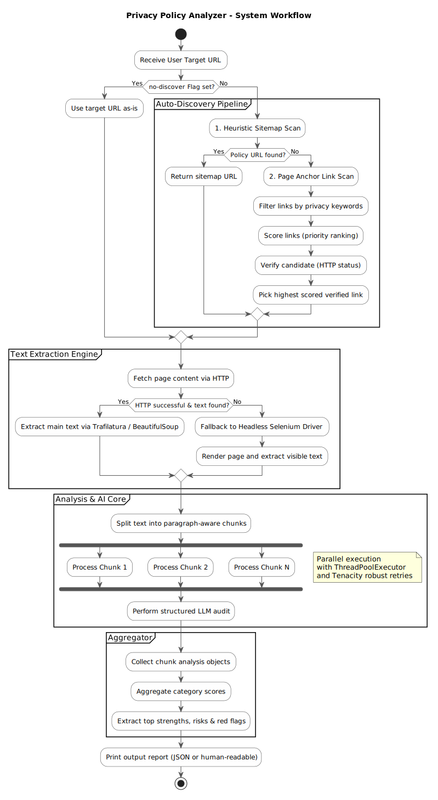

# Privacy Policy Analyzer

[](https://opensource.org/licenses/MIT)
[](https://www.python.org/downloads/)
[](
  https://github.com/HappyHackingSpace/privacy-policy-analyzer/stargazers
)
[](
  https://github.com/HappyHackingSpace/privacy-policy-analyzer/network
)

Analyze a website's privacy policy end-to-end: **auto-discover** the policy URL, **fetch** clean text
(HTTP first, Selenium fallback), **chunk** the content, **evaluate** it via an LLM with a structured rubric,
and **aggregate** category scores into an overall score with strengths, risks, red flags, and recommendations.

> **Part of [Happy Hacking Space](https://github.com/HappyHackingSpace) - A community-driven
> organization focused on security, AI, and software development.**

## Architecture & How It Works



## Features

- **Multi-LLM Provider Engine**: Seamlessly switch between **Google Gemini** (using official `google-genai` SDK) and **OpenAI GPT** models based on model name prefix.
- **Auto-discovery**: Common paths → robots.txt/sitemaps → footer links.
- **HTTP-first extraction**: `trafilatura` (clean text) or `BeautifulSoup` fallback; **Selenium** for dynamic pages.
- **Structured scoring (JSON)**: Per-category (0–10) scores + rationales; aggregated to 0–100 overall in `scoring.py`.
- **Configurable chunking**: Paragraph-aware recursive splitting; `--max-chunks` hard cap to control cost/latency.
- **Simple CLI**: Choose `summary`, `detailed`, or `full` reports.

## Project Layout

```
privacy-policy-analyzer/
├── src/
│   ├── __init__.py
│   ├── main.py                    # Main CLI application
│   └── analyzer/
│       ├── __init__.py
│       ├── prompts.py             # LLM prompts for analysis
│       └── scoring.py             # Scoring algorithms
├── docs/                          # Documentation
│   ├── index.md
│   ├── user-guide.md
│   ├── api.md
│   ├── contributing.md
│   └── changelog.md
├── .github/
│   └── workflows/                 # CI/CD pipelines
│       ├── ci.yaml
│       └── release.yml
├── pyproject.toml                 # Project configuration
├── requirements.txt               # Legacy requirements
├── .env.example                   # Environment template
├── RESULTS.md                     # Benchmarks & real-world scores (GitHub, TikTok, Meta)
├── .gitignore
├── LICENSE
└── README.md
```

## Requirements

- Python **3.10.11 or higher**
- An **OpenAI API key** (for GPT models) and/or **Google Gemini API key** (for Gemini models)
- (Optional) **Chrome/Chromium** on the machine (Selenium fallback; driver auto-installs)

## Installation

### Using uv (Recommended)

```bash
# Clone the repository
git clone https://github.com/HappyHackingSpace/privacy-policy-analyzer.git
cd privacy-policy-analyzer

# Install dependencies
uv sync

# Activate the virtual environment
source .venv/bin/activate  # On macOS/Linux
# or
.venv\Scripts\activate     # On Windows
```

### Using pip

```bash
# Clone the repository
git clone https://github.com/HappyHackingSpace/privacy-policy-analyzer.git
cd privacy-policy-analyzer

# Create virtual environment
python -m venv venv
source venv/bin/activate  # On macOS/Linux
# or
venv\Scripts\activate     # On Windows

# Install dependencies
pip install -e .
```

## Configuration

Copy `.env.example` → `.env` and set your credentials:

```
OPENAI_API_KEY=sk-************************
OPENAI_MODEL=gpt-4o

# Required if using Gemini models (e.g. gemini-2.5-flash)
GEMINI_API_KEY=AIzaSy*********************
```

## Usage

### Quick start (auto-discovery, summary report)

```bash
# Using uv
uv run python src/main.py --url https://www.example.com/ --report summary

# Using pip
python src/main.py --url https://www.example.com/ --report summary
```

### Detailed JSON (category scores, rationales, red flags)

```bash
uv run python src/main.py --url https://www.example.com/ --report detailed
```

### Force a specific fetch method

- HTTP only (faster/cleaner when available):

```bash
uv run python src/main.py --url https://www.example.com/ --fetch http --report detailed
```

- Selenium only (for heavily dynamic pages):

```bash
uv run python src/main.py --url https://www.example.com/ --fetch selenium --report detailed
```

### Skip auto-discovery (analyze a known policy URL as-is)

```bash
uv run python src/main.py --url https://www.example.com/legal/privacy --no-discover --report detailed
```

### Tuning chunking and cost/latency

```bash
# Larger chunks = fewer requests (cheaper/faster), but slightly coarser analysis
uv run python src/main.py --url https://example.com --chunk-size 3500 --chunk-overlap 350 --max-chunks 30 --report summary
```

## CLI Options (summary)

- `--url` **(required)**: Site homepage or direct privacy policy URL.
- `--model` *(default: env `OPENAI_MODEL` or `gpt-4o`)*: OpenAI chat model name.
- `--fetch` *(default: `auto`)*: `auto` | `http` | `selenium`.
- `--no-discover`: Analyze the given URL without discovery.
- `--chunk-size` *(default: 3500)* and `--chunk-overlap` *(default: 350)*.
- `--max-chunks` *(default: 30)*: Hard cap; tail chunks are merged to keep requests bounded.
- `--report` *(default: `summary`)*: `summary` | `detailed` | `full`.

## Output

- **summary**: overall score, confidence, top strengths/risks, red-flags count.
- **detailed**: adds per-category scores (0–10), rationales, deduped red flags,
  recommendations.
- **full**: includes all per-chunk JSON items along with the aggregated report.

## Notes & Tips

- **Determinism**: For consistent runs, pin `--fetch http` or `--fetch selenium` and/or use
  `--no-discover` with a fixed policy URL.
- **International sites**: The HTTP client sets `Accept-Language: en-US,en;q=0.9` to reduce
  locale variance.
- **Selenium**: Ensure Chrome/Chromium exists; `chromedriver-autoinstaller` will fetch a matching
  driver automatically.

## Troubleshooting

- **`ImportError: lxml.html.clean ...`**
  Ensure `lxml[html_clean]` is installed (it’s included in `requirements.txt`).
- **Very low or inconsistent scores**
  Try `--fetch selenium` or analyze the explicit policy URL with `--no-discover`. Some sites
  serve different content per region/session.

## Security & Ethics

This tool provides **automated analysis heuristics** and LLM-generated assessments. Treat results
as decision support, not legal advice. Always review the original policy and consult qualified
counsel for compliance-critical use cases.

## Documentation

- 📖 **[Full Documentation](https://happyhackingspace.github.io/privacy-policy-analyzer/)** - Complete user
  guide and API reference
- 🚀 **[Quick Start Guide](https://happyhackingspace.github.io/privacy-policy-analyzer/user-guide/)** - Get
  up and running quickly
- 🔧 **[API Reference](https://happyhackingspace.github.io/privacy-policy-analyzer/api/)** - Detailed API
  documentation
- 🤝 **[Contributing](https://happyhackingspace.github.io/privacy-policy-analyzer/contributing/)** - How to
  contribute to the project

## About Happy Hacking Space

This project is part of [Happy Hacking Space](https://github.com/HappyHackingSpace), a
community-driven organization focused on:

- 🔒 **Security Research** - Tools and techniques for security professionals
- 🤖 **AI & Machine Learning** - Practical AI applications and research
- 💻 **Software Development** - Open source tools and libraries
- 🌐 **Community Building** - Bringing together developers, researchers, and security experts

### Other Projects

- [vulnerable-target](https://github.com/HappyHackingSpace/vulnerable-target) - Intentionally
  vulnerable environments for security training
- [events](https://github.com/HappyHackingSpace/events) - Community events directory
- [site](https://github.com/HappyHackingSpace/site) - Happy Hacking Space website

## Contributing

We welcome contributions! Please see our
[Contributing Guide](https://happyhackingspace.github.io/privacy-policy-analyzer/contributing/) for details.

1. Fork the repository
2. Create a feature branch (`git checkout -b feature/amazing-feature`)
3. Commit your changes (`git commit -m 'Add some amazing feature'`)
4. Push to the branch (`git push origin feature/amazing-feature`)
5. Open a Pull Request

## Support

- 🐛 **Bug Reports**: [GitHub Issues](https://github.com/HappyHackingSpace/privacy-policy-analyzer/issues)
- 💬 **Discussions**: [GitHub Discussions](https://github.com/HappyHackingSpace/privacy-policy-analyzer/discussions)
- 📧 **Contact**: [Happy Hacking Space](https://github.com/HappyHackingSpace)

## License

This project is licensed under the MIT License - see the [LICENSE](LICENSE) file for details.

## Acknowledgments

- Built with ❤️ by the [Happy Hacking Space](https://github.com/HappyHackingSpace) community
- Powered by OpenAI's GPT models
- Uses [trafilatura](https://github.com/adbar/trafilatura) for web content extraction
- Inspired by the need for better privacy policy transparency
